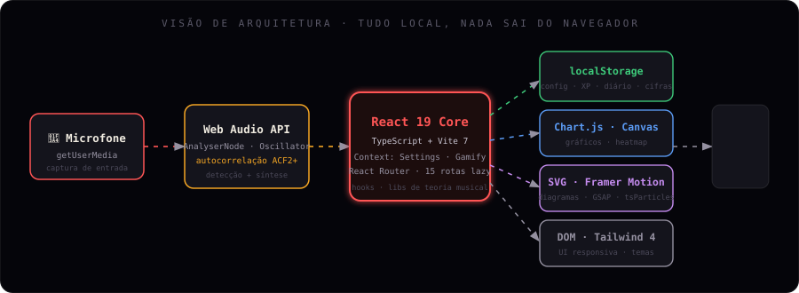

<div align="center">



<br/>

[](https://react.dev)
[](https://www.typescriptlang.org)
[](https://vite.dev)
[](https://tailwindcss.com)
[](https://developer.mozilla.org/docs/Web/API/Web_Audio_API)
[](#-licença)

</div>

---

> _O violão não liga para qual framework você usa. O **TunaGuitar** também não — ele só quer te deixar afinado, no tempo e praticando._

**TunaGuitar** é uma suíte completa de prática para violão e guitarra que roda **inteiramente no navegador**. Sem servidor, sem conta, sem instalação. Da afinação por microfone em tempo real ao diário de prática com gamificação, **todo o áudio é sintetizado** pela Web Audio API e **todos os dados ficam no seu dispositivo** (`localStorage`). São **15 módulos** integrados, interface responsiva, suporte a **PT-BR e inglês** e foco em precisão.

<div align="center">
  
</div>

## ✨ Destaques

- 🎯 **Afinador cromático real** — detecção de pitch por autocorrelação (algoritmo **ACF2+**) direto do microfone, com `A4` e tolerância (cents) configuráveis.
- 🔊 **Zero arquivos de áudio** — metrônomo, acordes, intervalos e cliques são gerados por osciladores + envelopes de ganho.
- 🗄️ **Offline-first** — configurações, XP, diário e cifras persistem em `localStorage`. Nada sai do navegador.
- 🏆 **Gamificação** — XP, missões diárias, conquistas e _streak_ de prática.
- 🌎 **Bilíngue** — interface em **Português** e **Inglês**.
- 🎨 **Personalizável** — cor de destaque, densidade, animações (`all` / `reduced` / `off`), perfil e tipo de instrumento.
- ⚡ **Rápido** — rotas com _lazy loading_; áudio e gráficos pesados ficam fora do bundle inicial.

<div align="center">
  
</div>

## 🧩 Módulos

| # | Módulo | Rota | O que faz |
|---|--------|------|-----------|
| 01 | 🎵 **Afinador** | `/` | Detecção de pitch em tempo real (ACF2+), 4 afinações, agulha com física |
| 02 | ⏱️ **Metrônomo** | `/metronomo` | Scheduler Web Audio, tap tempo, compassos, timbres sintetizados |
| 03 | 🎶 **Acordes** | `/acordes` | Biblioteca com diagramas SVG, 8 categorias e preview de áudio |
| 04 | 📄 **Cifrador** | `/cifrador` | Editor de cifras com renderização e transposição |
| 05 | 🔀 **Progressões** | `/progressoes` | Montagem e estudo de progressões harmônicas |
| 06 | 🥁 **Ritmos** | `/ritmos` | Padrões de batida com síntese e referência visual |
| 07 | 👂 **Ouvido** | `/ouvido` | Treino de notas, intervalos e acordes (gamificado) |
| 08 | 🎸 **Escalas** | `/escalas` | Braço interativo com **13 escalas** e posições |
| 09 | ↔️ **Capotraste** | `/capotraste` | Calculadora de transposição e posição de capo |
| 10 | 🔁 **Loop** | `/loop` | Estação de loop no navegador para sobrepor camadas |
| 11 | 📅 **Diário** | `/diario` | Registro de sessões, heatmap e gráficos de progresso |
| 12 | 🏆 **Conquistas** | `/conquistas` | XP, níveis, missões diárias e badges |
| 13 | 🎓 **Teoria** | `/teoria` | Referência de teoria musical aplicada ao instrumento |
| 14 | 📺 **Performance** | `/performance` | Modo palco em tela cheia com setlist |
| 15 | ⚙️ **Config** | `/config` | Perfil, áudio, aparência, idioma, dados e atalhos |

> Páginas auxiliares: **Manual** (`/manual`), **Privacidade** (`/privacidade`) e **Termos** (`/termos`).

<div align="center">
  
</div>

## 🏗️ Arquitetura

<div align="center">
  
</div>

O fluxo é totalmente local: o microfone alimenta a **Web Audio API**, que entrega frequência ao **núcleo React** (estado global via Context). A partir dele, as saídas se ramificam em **persistência** (`localStorage`), **gráficos** (Chart.js/Canvas), **visualização** (SVG + Framer Motion/GSAP) e **UI** (DOM + Tailwind). Nenhum dado trafega para fora do dispositivo.

<div align="center">
  
</div>

## 🚀 Começando

Pré-requisito: **Node.js 18+**.

```bash
# 1. Clonar
git clone https://github.com/MatheusChiodi/TunaGuitar.git
cd TunaGuitar

# 2. Instalar dependências
npm install

# 3. Ambiente de desenvolvimento (Vite)
npm run dev

# 4. Build de produção + preview
npm run build
npm run preview
```

| Script | Ação |
|--------|------|
| `npm run dev` | Servidor de desenvolvimento com HMR |
| `npm run build` | Build otimizado em `dist/` |
| `npm run preview` | Serve o build de produção localmente |
| `npm run typecheck` | Checagem de tipos com `tsc --noEmit` |

> ⚠️ **Permissão de microfone** — Afinador e Treino de Ouvido usam `getUserMedia`. O navegador vai pedir acesso ao microfone; clique em **Permitir**. O áudio é processado localmente e **nunca** é transmitido nem armazenado.

<div align="center">
  
</div>

## 🛠️ Stack

| Camada | Tecnologias |
|--------|-------------|
| **Core** | React 19 · TypeScript · Vite 7 · React Router 7 |
| **Estilo** | Tailwind CSS 4 · CSS custom properties (temas em runtime) |
| **Áudio** | Web Audio API (`AnalyserNode`, `OscillatorNode`) · autocorrelação ACF2+ |
| **Animação** | Framer Motion · GSAP · tsParticles · Lenis · Splitting · Vanilla Tilt |
| **Dados/UI** | Chart.js + react-chartjs-2 · SortableJS · Tippy.js · Notyf · Driver.js · lucide-react |

<div align="center">
  
</div>

## 📁 Estrutura

```text
TunaGuitar/
├── assets/                 # SVGs animados deste README
├── index.html              # entrada Vite (fontes, metas PWA)
├── src/
│   ├── main.tsx            # bootstrap React
│   ├── App.tsx             # providers + rotas (lazy)
│   ├── index.css           # Tailwind + tokens de tema
│   ├── components/         # Navbar, Sidebar, Fretboard, TunerDisplay, ChordDiagram…
│   ├── pages/              # 1 página por módulo (TunerPage, MetronomePage…)
│   ├── context/            # SettingsContext · GamifyContext
│   ├── hooks/              # usePitchDetection · useMetronome · useTilt…
│   └── lib/                # audio · pitch (ACF2+) · theory · chords · i18n · storage…
├── vite.config.ts
├── tsconfig.json
└── package.json
```

<div align="center">
  
</div>

## 🎛️ Por dentro

<details>
<summary><b>🎵 Afinador</b> — detecção de pitch por autocorrelação</summary>

<br/>

O `usePitchDetection` abre o microfone via `getUserMedia`, conecta um `AnalyserNode` (`fftSize = 2048`) e lê o sinal no domínio do tempo com `getFloatTimeDomainData`. A frequência é estimada por **autocorrelação (ACF2+)** em `src/lib/pitch.ts` e convertida em nota/oitava a partir do número MIDI.

| Parâmetro | Detalhe |
|-----------|---------|
| Algoritmo | Autocorrelação ACF2+ |
| Referência | `A4` configurável (padrão 440 Hz) |
| Tolerância | Em cents, ajustável nas configurações |
| Afinações | Padrão (EADGBE), Drop D, Meio-tom abaixo (Eb), DADGAD |
| Estabilidade | _Hold_ de 250 ms para evitar oscilação visual |

</details>

<details>
<summary><b>🔊 Motor de áudio</b> — tudo sintetizado, zero arquivos</summary>

<br/>

`src/lib/audio.ts` expõe um `AudioEngine` singleton sobre a Web Audio API. Notas, cliques e timbres nascem de **osciladores + envelopes de ganho** — não há nenhum arquivo `.mp3`/`.wav` no bundle. Há controle de volume master e tipos de clique do metrônomo (`wood`, `electronic`, `metallic`).

</details>

<details>
<summary><b>🏆 Gamificação</b> — XP, missões e streak</summary>

<br/>

`GamifyContext` acompanha XP, contadores, missões diárias e conquistas, tudo persistido em `localStorage`. Exemplos de missões: afinar o violão, praticar 20 min, completar 10 exercícios de ouvido, aprender 3 acordes, registrar uma sessão no Diário. O _streak_ é calculado a partir das datas das sessões.

</details>

<details>
<summary><b>⚙️ Configurações</b> — personalização completa</summary>

<br/>

`SettingsContext` controla `A4`, tolerância, afinação ativa, cor de destaque (aplicada em runtime via CSS custom property), densidade, nível de animação (`all`/`reduced`/`off`), volume master, sensibilidade, atalhos de teclado, idioma (PT-BR/EN) e perfil (tipo de instrumento, experiência). Tudo salvo em `localStorage`.

</details>

<div align="center">
  
</div>

## 🌐 Compatibilidade

Funciona em qualquer navegador moderno com **Web Audio API** e **getUserMedia**.

| Navegador | Afinador / Ouvido | Demais módulos |
|-----------|:-----------------:|:--------------:|
| Chrome / Edge 90+ | ✅ | ✅ |
| Firefox 88+ | ✅ | ✅ |
| Safari 14.1+ | ✅ | ✅ |
| Opera 76+ | ✅ | ✅ |
| Mobile (Chrome / Safari) | ✅¹ | ✅ |

> ¹ O acesso ao microfone exige **HTTPS** (ou `localhost`) e um gesto do usuário para iniciar o `AudioContext`.

<div align="center">
  
</div>

## 🤝 Contribuindo

Contribuições são bem-vindas. Antes de abrir um PR:

- [ ] `npm run typecheck` passa sem erros.
- [ ] Áudio segue sintetizado pela Web Audio API — sem arquivos de mídia.
- [ ] Dados continuam apenas em `localStorage` — sem backend/contas.
- [ ] Cores vêm de tokens de tema, não de hex fixos espalhados.
- [ ] Novos módulos seguem o padrão de rota + página em `src/pages`.

```bash
git checkout -b feat/minha-feature
# ... código ...
npm run typecheck
git commit -m "feat: adiciona minha feature"
```

## 📄 Licença

Distribuído sob a licença **MIT** © 2026 [Matheus Chiodi](https://github.com/MatheusChiodi). Use, copie, modifique e distribua livremente.

<div align="center">


<sub>Feito para quem pratica todo dia — por um dev que queria estudar violão sem anúncios.</sub>

<br/>

<sub><a href="#-começando">Começar</a> · <a href="#-módulos">Módulos</a> · <a href="#️-arquitetura">Arquitetura</a> · <a href="#-contribuindo">Contribuir</a></sub>

</div>
